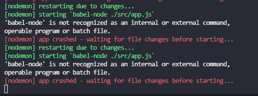
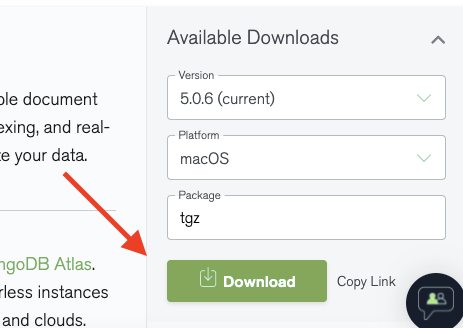
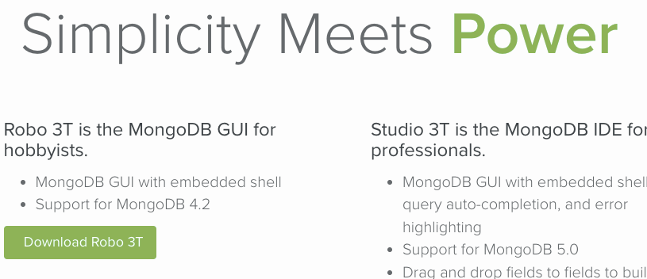

# Buổi 3

# Setup Babel
1. npm i --save-dev babel-cli babel-preset-env babel-preset-stage-0

2. create file .babelrc

    { "presets": ["env","stage-0"] }

3. package.json

    "script": "nodemon ./src/app.js --exec babel-node -e js"

Nếu lỗi babel-node
    `npm i -g babel-node`

>  
>  
> run command line line : `npm i -g babel-node `

# Setup mongodb
1. Download [MongoDB Community](https://www.mongodb.com/try/download/community)

1. Download [GUI Robo3T](https://robomongo.org/) not Studio Robo3T

 